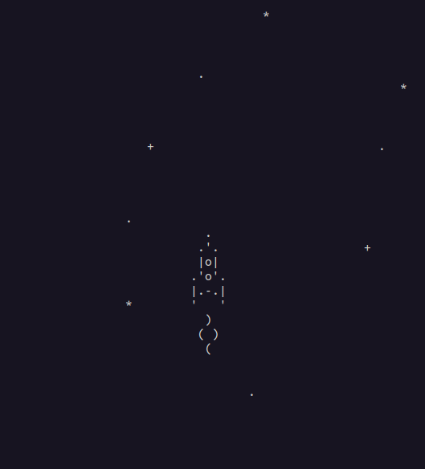

# Космическая аркада.

Игра позволяет перемещать космический корабль по игровому полю клавишами:

вверх, вниз, влево, и вправо.

### Как запустить

[Python](https://www.python.org/downloads/) должен быть установлен.

Затем клонируйте репозиторий:

```bash
git clone git@github.com:CaDiBob/async_lesson_1.git
```

И запустите:

```bash
python main.py
```

### Анимация игры:


